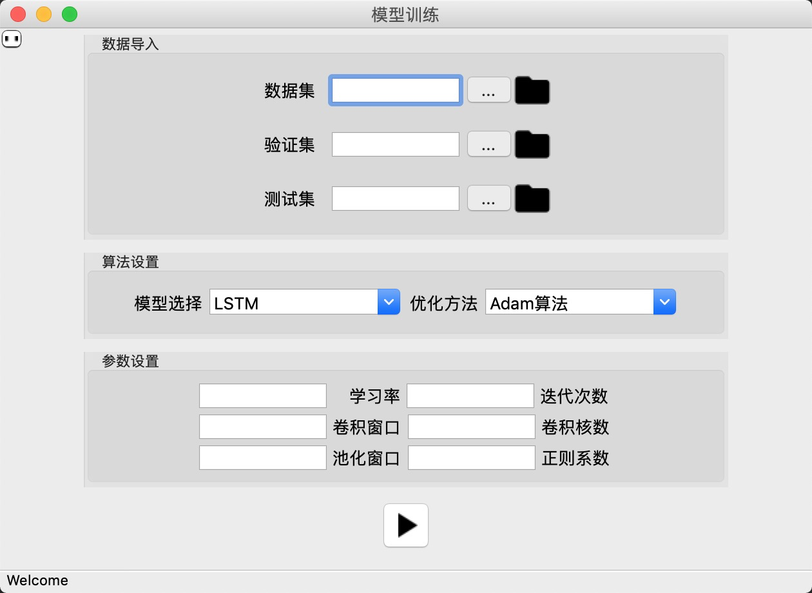
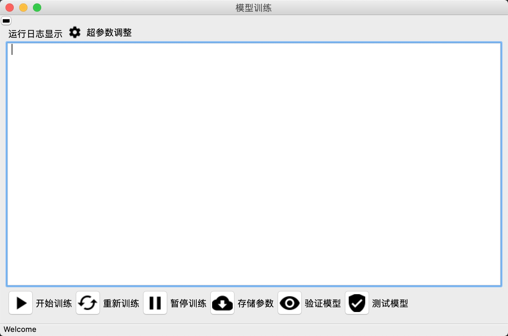

# CNN_qleaning_for_QA

## :cat: ​ introduction

本软件包含两部分：

1. 模型训练的数据读入部分,包含各类训练所需参数的组合;
2. 模型训练部分，包含模型的训练、验证、测试，以及暂停、参数存储等内容;

本软件仅作为训练的前端界面，并将相应的接口暴露给后端，由后端实现接口。

#### :baby_chick: 数据读入

第一个界面进行参数选择：

1. 数据集：参数路径包含三部分参数，数据集路径、验证集、测试集
   - 本部分不用个人处理，后台汇报参数传给指定函数，直接调用；
2. 算法设置：模型选择和优化方法
   - 选择模型的类型和优化方法，优化方法会以名字字符串的形式传递给后台；
3. 参数设置：
   - 将学习率等参数传递给后台，后台会自动传递给指定函数，直接执行；

#### :cow: 模型训练

##### 代码改写：put_on_train函数，put_on_dev函数 和put_on_test 函数，

通过编写这几个函数，可以和前台无缝对接，函数自带参数，准确率作为函数的返回值，将会在训练完成后输出

##### 代码改写：change_value函数

通过将change_value函数接入到日志系统，可以完成日志参数的显示

